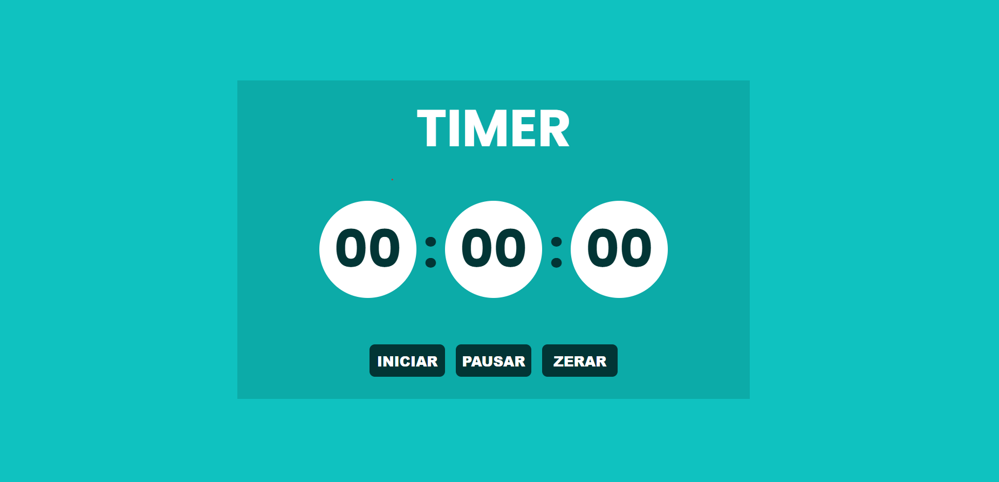

# Timer

Este é um projeto de um timer simples desenvolvido com HTML, CSS e JavaScript. Ele possui funcionalidades básicas como iniciar, pausar e zerar o contador, com um design agradável e responsivo.

## Funcionalidades

- **Iniciar**: Começa a contagem do tempo.
- **Pausar**: Pausa a contagem e altera a cor do timer para indicar o estado pausado.
- **Zerar**: Reinicia a contagem para `00:00:00` e retorna o layout ao estado inicial.

## Tecnologias Utilizadas

- **HTML**: Estrutura do projeto.
- **CSS**: Estilização e design responsivo.
- **JavaScript**: Lógica e interatividade do timer.

## 🔗 Link do Projeto

[Veja o projeto em execução](https://timer-virid-five.vercel.app/)

---

## Exemplo de Tela



---

## Estrutura do Projeto

```plaintext
├── index.html   # Estrutura do layout
├── style.css    # Estilos visuais
└── script.js    # Lógica do timer
